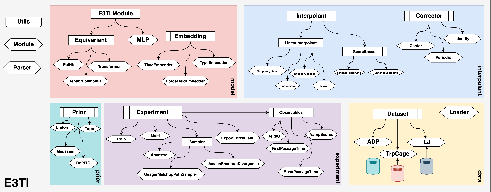

# Molecular Interpolant using Neural Transporters (MINT)



## Environment setup (UMN/MSI)

This project was run on UMN MSI GPU nodes using an interactive SLURM allocation, the UMN module stack (GCC/OpenMPI/CUDA), and a micromamba environment. The provided `setup_umn.sh` script reproduces the *working* environment `mintenv` used for the paper experiments by installing pinned versions of the CUDA 11.8 PyTorch stack, PyG (torch-geometric + compiled extensions), and supporting scientific packages.

**Important note on reproducibility vs. minimal dependencies:**
- The environment created by `setup_umn.sh` is intentionally a "known-good" snapshot that matches a working UMN/MSI setup. It may include more packages than are strictly required by the current codebase. This is expected: the goal is to replicate the results reliably, not to minimize the dependency set.
- A pipreqs-generated `requirements.txt` is included for reference, but pipreqs can miss conditional/dynamic imports and does not capture the GPU-wheel index URLs needed for torch/PyG. For exact replication on UMN/MSI, use `setup_umn.sh`.

### 1) Install micromamba (one-time)

Run:
```bash
"${SHELL}" <(curl -L micro.mamba.pm/install.sh)
```

Verify:
```bash
micromamba --version
```

If your shell does not pick it up immediately, restart the shell.

### 2) Request a GPU (interactive)

Choose one of the following, depending on what is available/appropriate:

- **A40 (basic)**
```bash
srun -N1 --ntasks=1 --gres=gpu:a40:1 -p interactive-gpu -t 04:00:00 --pty bash
```

- **A40 (more CPU tasks; useful for heavier dataloading)**
```bash
srun -N1 --ntasks-per-node=8 --cpus-per-task=1 --gres=gpu:a40:1 -p interactive-gpu -t 08:00:00 --pty bash
```

- **V100 (example request)**
```bash
srun -N 1 -t 08:00:00 --ntasks-per-node=1 -p v100 --mem-per-cpu=20gb --gres=gpu:1 --pty bash
```

### 3) Load the compiler/MPI/CUDA modules

In the allocated shell:
```bash
conda deactivate
module load gcc/8.2.0
module load ompi/3.1.6/gnu-8.2.0
module load cuda/11.8.0-gcc-7.2.0-xqzqlf2
```

### 4) Create/install the pinned Python environment (one-time)

From the repo root (the directory containing `setup_umn.sh`):
```bash
chmod +x setup_umn.sh
./setup_umn.sh
```

Use the package versions pinned in `setup_umn.sh`. Beware that things may not run if you modify it too much.

### 5) Activate the environment (every session)

After you request a GPU and load modules:
```bash
micromamba activate mintenv
```

Recommended sanity checks:

- Confirm a GPU is visible:
```bash
nvidia-smi
```

- Confirm PyTorch sees CUDA:
```bash
python -c "import torch; print(torch.__version__); print('CUDA available:', torch.cuda.is_available())"
```

### 6) `requirements.txt`

A `pip freeze > requirements.txt` generated `requirements.txt` is included for reference. We recommend using `setup_umn.sh` instead.

## Provided checkpoint and training configuration

A pretrained checkpoint is available at **[here](https://drive.google.com/file/d/1mLgu-XAAchu-LjP4JbRDX0Wb-R6oyNEl/view?usp=sharing)**. This checkpoint was trained for approximately **10 hours** using the configuration below.

### How to use the checkpoint

1. Download the checkpoint from  **[here](https://drive.google.com/file/d/1mLgu-XAAchu-LjP4JbRDX0Wb-R6oyNEl/view?usp=sharing)**.
2. Place it inside:
   - `mint/main/`
3. Update the checkpoint/base filename (and your `base` directory, if applicable) in `generate.py` so it points to the downloaded file.

### Configuration used to train the checkpoint

```yaml
prior:
  _target_: mint.prior.normal.NormalPrior
  mean: 0.0
  std: 0.5

embedder:
  _target_: mint.model.embedding.equilibrium_embedder.EquilibriumEmbedder
  use_ff: true
  interp_time:
    embedding_dim: 256
    max_positions: 1000
  force_field:
    in_dim: 5
    hidden_dims: [128, 64]
    out_dim: 32
    activation: silu
    use_input_bn: false
    affine: false
    track_running_stats: false
  atom_type:
    num_types: 14
    embedding_dim: 32

model:
  _target_: mint.model.equivariant.PaiNN.PaiNNLikeInterpolantNet
  irreps_input: [[320], []]
  irreps: [[32, 32], []]
  irreps_readout_cond: [[32, 32], []]
  irreps_readout: [[0, 1], []]
  edge_l_max: 1
  max_radius: 1000
  max_neighbors: 1000
  number_of_basis: 64
  edge_basis: gaussian
  mlp_act: silu
  mlp_drop: 0
  conv_weight_layers: [192]
  update_weight_layers: [128]
  message_update_count_cond: 2
  message_update_count_eta: 2
  message_update_count_b: 2

interpolant:
  _target_: mint.interpolant.interpolants.TemporallyLinearInterpolant
  velocity_weight: 1.0
  denoiser_weight: 1.0
  gamma_weight: 0.1  # (= 1/10)

validation:
  stratified: false

optim:
  optimizer:
    name: Adam
    lr: 5e-4
    betas: [0.9, 0.999]
  scheduler:
    name: CosineAnnealingLR
    T_max: experiment.train.trainer.max_epochs
    eta_min: 1e-6

augment_rotations: false
meta_keys: ds_train.meta_keys
```

## Obtaining the Training Dataset

### Prepare ADP dataset files (rename + place)

After downloading the three XTC trajectories from **[here](https://markovmodel.github.io/mdshare/ALA2/)**, rename them to the filenames expected by the code and place them under `mint/data/ADP/` alongside the PDB.

### Required renames

Move/copy your downloaded files into `mint/data/ADP/` and rename as follows:

- `alanine-dipeptide-nowater.pdb` → `mint/data/ADP/alanine-dipeptide-nowater.pdb`
- `alanine-dipeptide-0-250ns-nowater.xtc` → `mint/data/ADP/alanine-dipeptide-250ns-nowater_train.xtc`
- `alanine-dipeptide-1-250ns-nowater.xtc` → `mint/data/ADP/alanine-dipeptide-250ns-nowater_valid.xtc`
- `alanine-dipeptide-2-250ns-nowater.xtc` → `mint/data/ADP/alanine-dipeptide-250ns-nowater_test.xtc`

### Example command sequence

From the folder where you downloaded the files:
```bash
mkdir -p /path/to/mint/data/ADP

cp alanine-dipeptide-nowater.pdb /path/to/mint/data/ADP/

cp alanine-dipeptide-0-250ns-nowater.xtc /path/to/mint/data/ADP/alanine-dipeptide-250ns-nowater_train.xtc
cp alanine-dipeptide-1-250ns-nowater.xtc /path/to/mint/data/ADP/alanine-dipeptide-250ns-nowater_valid.xtc
cp alanine-dipeptide-2-250ns-nowater.xtc /path/to/mint/data/ADP/alanine-dipeptide-250ns-nowater_test.xtc
```

Sanity check:
```bash
ls -1 mint/data/ADP
```
Expected:
- `alanine-dipeptide-nowater.pdb`
- `alanine-dipeptide-250ns-nowater_train.xtc`
- `alanine-dipeptide-250ns-nowater_valid.xtc`
- `alanine-dipeptide-250ns-nowater_test.xtc`

## Reproducing Results

### Generate

Before running, you must obtain a trained model checkpoint and update the base filename in `generate.py` to point to it. The checkpoint needs to be stored within `mint/main`. You must modify the **base directory** used by the script/config so the paths resolve correctly on your system. This is located within `generate.py` in a string variable named `base`.

To obtain samples, `cd` into `mint/main` and run:
```bash
python generate.py
```

This script loads the model and integrates the stochastic interpolant forward in time to generate samples from the trained distribution. Outputs are written to `mint/main/output.xyz`. It will take 40-45 minutes roughly on an A40. 

You can view the resulting `.xyz` file with Ovito: https://www.ovito.org/.

To switch between SDE and ODE sampling, modify the relevant `generate_cfg` settings used by `generate.py` (SDE vs. ODE mode). Other such hyper parameters may be modified by inspecting the relevant configs (epsilon function, number of samples, return trajectory, etc.)

### Dihedral

This must be run **after** `generate` (i.e., after `output.xyz` has been produced). Running `dihedral` will create two plots in the output directory:

- `FreeEnergy.png` relative energy of folding as a function of the phi psi angle.
- `Probability.png` estimate probability of folding as a function of the phi psi angle.

### Train

Before running, you must modify the **base directory** used by the script/config so the paths resolve correctly on your system.  This is located within `train.py` in a string variable named `base`. Before running be sure you are signed into wandb within that console.

Training is launched from the same directory as `generate.py`. `cd` into `mint/main` and run:
```bash
python train.py
```
You can run this inline (interactive GPU session) or submit it using the provided SLURM script (which must be edited to match your resource/account/partition preferences). We reccomend the slurm method. It will take roughly 8 hours for 100 epochs of the default dataset sizes. The provided checkpoint ran for 10 hours.

Relevant model hyperparameters can be changed by inspecting the `EquivariantMINTModule` object and its associated configuration (i.e., the config fields that instantiate/parameterize the module).

During training, outputs are logged and saved to:
- Checkpoints: `base+"main/logs/hydra/ckpt"`
- Weights & Biases (wandb): `base+"main/logs/wandb"`

## Expected runtimes

Provide estimates for replication:
- Environment creation (`./setup_umn.sh`): 5 minutes
- Sampling for the paper results: 40 minutes
- Training from scratch: 10 hours

## Troubleshooting (common MSI issues)

- If you see `Killed` with no Python traceback, it is often an out-of-memory kill. Reduce memory usage (batch size, dataloader workers, caching) as needed.

- If CUDA is unavailable inside Python, re-check:
  1. You requested a GPU node
  2. The CUDA module is loaded
  3. You activated the correct micromamba environment
  4. The environment's torch (PyG stack) corresponds with the installed versions
